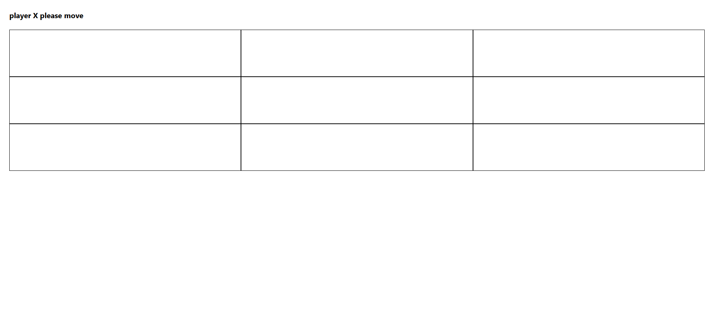

# Tic-Tac-Toe React App

A simple, single-page Tic-Tac-Toe game built with React.

## Features

- Two-player (X vs O) gameplay
- Shows current player's turn
- Detects and displays the winner or a draw
- "Play Again" button to restart the game

## How to Run

1. **Install dependencies:**
2. **Start the app:**
3. Open [http://localhost:3000](http://localhost:3000) in your browser.

## Project Structure

- `src/App.js` — Main app component
- `src/TicTacToegame/Board.jsx` — Game board logic and UI
- `src/TicTacToegame/square.jsx` — Individual square component

## Screenshot

## License

MIT License